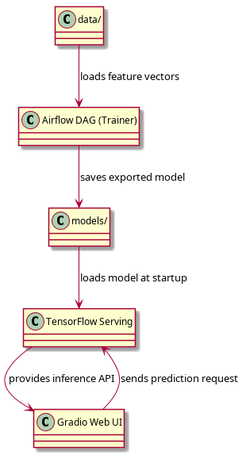

# system_of_machine_learning

A self-contained machine learning inference system using Airflow, TensorFlow Serving, and a Gradio-powered Web UI to train and serve a KNN model on binary feature data (e.g., from Ghidra reverse engineering exports).

---

## Project Layout

```
.
├── airflow/               # DAGs and Airflow configs
├── data/                  # Input data (JSON or .json.gz feature files)
├── docker-compose.yml     # Multi-container orchestration
├── Dockerfile             # Custom build context
├── models/                # Exported ML models
├── scripts/               # Custom utility scripts
├── webui/                 # Gradio Web UI interface
└── README.md              # This file!
```

---

## Quickstart

### 1. Build the Containers

```bash
docker-compose build
```

### 2. Start the Full Stack

```bash
docker-compose up -d
```

This launches:
- `airflow_training` – Runs your Airflow DAG that trains the KNN model.
- `tf_inference` – TensorFlow Serving exposing the model on port `8501`.
- `tf_web_ui` – Gradio-based Web UI on port `7860`.

### 3. Access the Interfaces

- **Airflow Web UI** → [http://localhost:8080](http://localhost:8080)
- **Gradio Web UI** → [http://localhost:7860](http://localhost:7860)
- **TensorFlow Serving** → [http://localhost:8501/v1/models/my_knn_model](http://localhost:8501/v1/models/my_knn_model)

---

## Useful Commands

### View Airflow Logs

```bash
docker-compose logs -f airflow_training
```

### Trigger DAG Manually

```bash
docker exec -it airflow_training airflow dags trigger train_knn_model
```

### Check Import Errors

```bash
docker exec -it airflow_training airflow dags list-import-errors
```

### Test TensorFlow Serving via cURL

```bash
curl http://localhost:8501/v1/models/my_knn_model
```

### Send a Prediction Request

```bash
curl -X POST http://localhost:8501/v1/models/my_knn_model:predict \
  -H "Content-Type: application/json" \
  -d '{
    "instances": [[10, 5, 120, 40]]
  }'
```

---

## Tear It Down

```bash
docker-compose down -v --remove-orphans
```

---

## 🗺️ System Architecture



This diagram shows the flow between data, training, model export, inference, and the web UI.

---

## 🧠 Features

- Airflow DAG to process `.json.gz` or `.json` feature vectors and train a scikit-learn KNN model.
- TensorFlow wrapper exports it in `SavedModel` format.
- TensorFlow Serving exposes inference API.
- Gradio Web UI for manual input testing.

---

## 🏁 Tip

Before running the DAG, make sure your `data/` folder contains `.json` or `.json.gz` feature vectors


## Machine Learning Aided Steganography
The goal of this project was more of generalizing on a modest dataset, and availble publicly, the use of audio to hide data within WAV files.

**Current State of Project:** Active Development and fine tuning to get to work, currently it's only a rough prototype code.

#### Discalimer
This isn't really working perfectly and is only a short idea, not intended for real world use, yet...


###  What and Why
The idea was first to first engineer a cryptographic system that could be hidden in plain sight.  Then it morphed to starting if I could hide sound files within a sound file.
Which ultimately led to engineering an encoder and decoder dual set.  Why I set out to do this, was is a series of code I write for freedom of speech and freedom to protect my own speech
in a manner of my choosing, not anyone else's decesion to decide when I can or how I can have private expressions of speech.
Whether that be an actor state foreign or domestic, cannot and should not have an authority that grants them a way to circumvent the 4th, 5th, or 1st amendments of the U.S. constitution.

Therefore I have over the course of 3 years developed and slowly making some of those ideas and technologies publicly avaiable in hopes they will be morphed, used, and ultimately
made better to promote freedom of speech while maintaining a peace of mind that the speech that you create, express, and/or produce are logarithmically hard to decipher unless read by the intended audience and
receipient.

### Encoder
The encoder will attempt to merge two audio files, where their is the true audio and the visible audio.  The true audio is a message you'd like to hide.
The visible audio will be the decoy message that hopefully will be a distraction to someone intercepting say a VOIP call.


### Decoder
the Decoder will take in the mixed audio (true + visible) audio channels and extract the true message.

### Use Case
Communications that are often monitored.

## Theory of ML aided Steganography

### **Loss Function Design and Theory**

To achieve steganography in audio with machine learning, the loss function must balance multiple objectives:

---

### **1. Key Objectives**
1. **Imperceptibility**:
   - The overt sound (e.g., elevator noise or music) must remain natural and unaltered to the human ear.
   - Achieved by ensuring the difference between the original and stego audio is minimal.

2. **Decodability**:
   - The hidden message must be accurately retrievable by the decoder network.
   - This ensures the robustness of the hidden data.

3. **Synchronization**:
   - The embedded data should align temporally with the VoIP stream or overt audio.
   - Temporal alignment is critical for practical real-time applications.

---

### **2. Loss Function Components**

#### **2.1. Reconstruction Loss (`L_recon`)**
- Ensures the stego audio (`S`) is perceptually similar to the original overt audio (`O`).
- Commonly measured using Mean Squared Error (MSE):


L_recon = MSE(O, S) = (1 / N) * Σ (O_i - S_i)^2


#### **2.3. Temporal Loss (`L_sync`)**
- Enforces synchronization between the stego audio and the VoIP stream.
- Penalizes deviations in time-aligned frames (`T`):


L_total = α * L_recon + β * L_msg + γ * L_sync

- **α**: Controls the weight of reconstruction (imperceptibility).
- **β**: Controls the importance of accurate message decoding.
- **γ**: Emphasizes synchronization for temporal alignment.

---

### **4. Implementation Tips**
1. **Tuning Weights (`α`, `β`, `γ`)**:
   - Start with equal weights and adjust based on observed performance.
   - For example:
     - Increase **α** if stego audio is too distorted.
     - Increase **β** if message retrieval accuracy is poor.

2. **Regularization**:
   - Add L2 regularization to ensure model stability and avoid overfitting.

3. **Evaluation Metrics**:
   - **Imperceptibility**: Use Signal-to-Noise Ratio (SNR) or Perceptual Evaluation of Speech Quality (PESQ).
   - **Decodability**: Use metrics like BLEU score or Word Error Rate (WER).
   - **Synchronization**: Visualize spectrograms to ensure temporal alignment.

---

This loss design ensures that the model simultaneously maintains audio quality, robustly encodes and decodes messages, and aligns with real-time audio requirements like VoIP streams.


